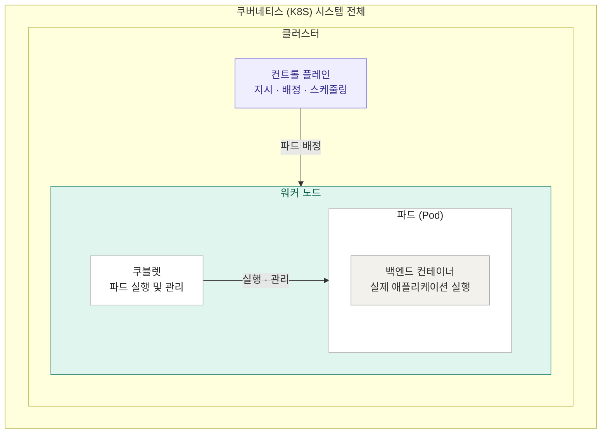

# Kubernetes 구조

```mermaid
flowchart TB
    subgraph K8S["쿠버네티스 (K8S) 시스템 전체"]
        subgraph Cluster["클러스터"]
            CP["컨트롤 플레인<br/>지시 · 배정 · 스케줄링"]

            subgraph Worker["워커 노드"]
                direction LR
                Kubelet["쿠블렛<br/>파드 실행 및 관리"]

                subgraph Pod["파드 (Pod)"]
                    Container["백엔드 컨테이너<br/>실제 애플리케이션 실행"]
                end

                Kubelet -->|실행 · 관리| Pod
            end

            CP -->|파드 배정| Worker
        end
    end

    style CP fill:#eeeeff,stroke:#7265dc,color:#37308c
    style Worker fill:#e0f5ed,stroke:#25846c,color:#075b47
    style Kubelet fill:#ffffff,stroke:#bbbbbb,color:#222222
    style Pod fill:#ffffff,stroke:#bbbbbb,color:#222222
    style Container fill:#f3f1eb,stroke:#999999,color:#333333
```
